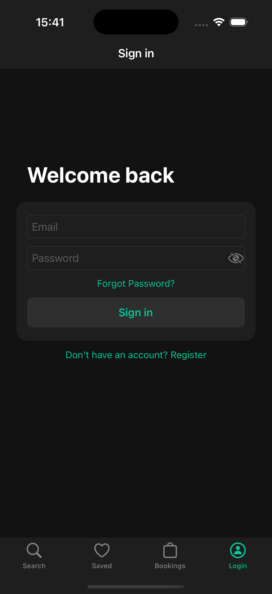
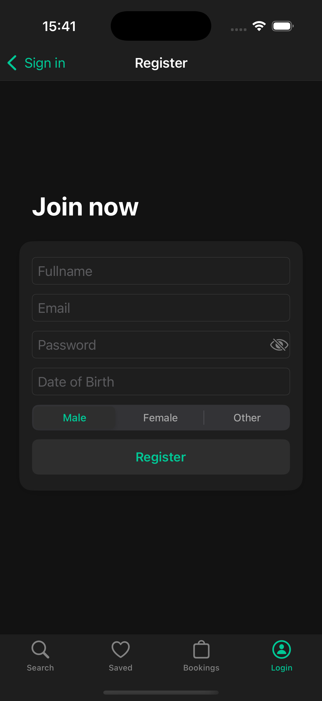
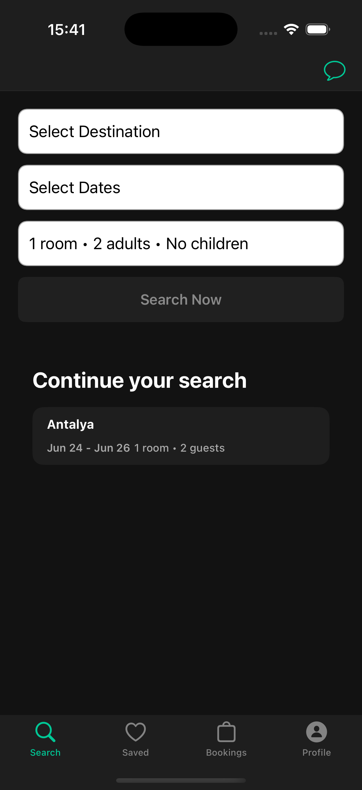
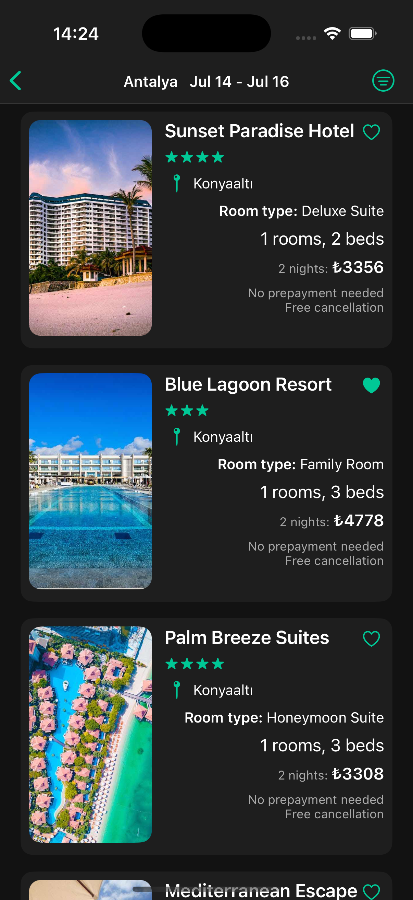
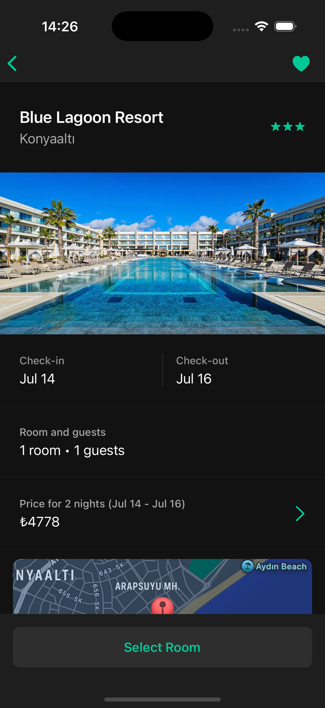
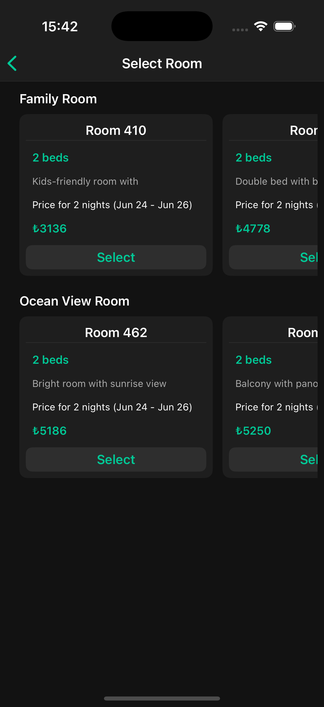
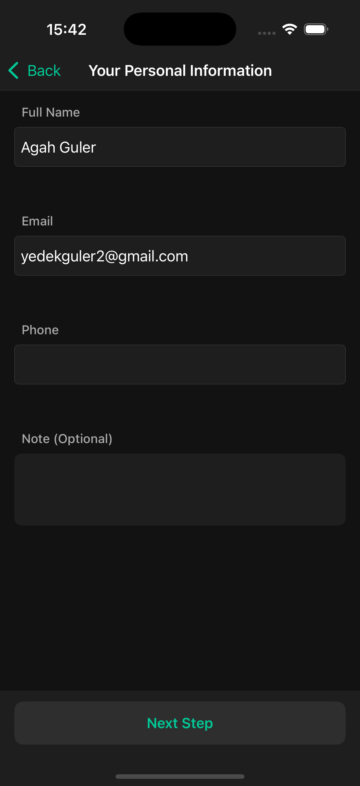
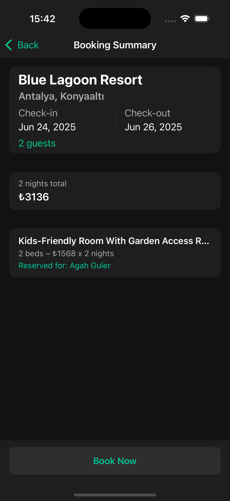

  

<h1> RoomNow </h1>
<h2> Agah Berkin Güler </h2>

 
Welcome to RoomNow. This is an iOS hotel reservation app where users can search, view, and book hotels with support for multi-room selection, user profiles, and an AI chatbot assistant. Admins can manage cities, hotels, rooms, users, and reservations.

## Table of Contents
- [Features](#features)
  - [Screenshots](#screenshots)
  - [Tech Stack](#tech-stack)
  - [Architecture](#architecture)
- [Getting Started](#getting-started)
  - [Prerequisites](#prerequisites)
  - [Installation](#installation)
- [Usage](#usage)
  - [Search & Results](#search--results)
  - [Hotel Detail](#hotel-detail)
  - [Reservation](#reservation)
  - [Saved Hotels](#saved-hotels)
  - [Profile](#profile)
  - [Admin Panel](#admin-panel)
- [Known Issues](#known-issues)
- [Improvements](#improvements)

## Features

**User Experience:**
- 🔍 Search hotels by city, dates, guests.
- 🏨 View hotel detail with rooms, map, and amenities.
- 💬 AI Chatbot assistant for guided hotel booking.
- 🛏️ Multi-room selection and dynamic availability.
- 💾 Save favorite hotels.
- 👤 Profile screen with editable details and profile image.

**Admin Panel:**
- 🏙️ Manage cities, hotels, and rooms.
- 📊 View all reservations and analytics.
- 👥 List all users with filter & search options.

## Screenshots

<table>
  <tr>
    <th>Sign In</th>
    <th>Register</th>
    <th>Search</th>
    <th>Result</th>
    <th>Detail</th>
    <th>RoomSelect</th>
    <th>Personal Info</th>
    <th>Booking Summary</th>
  </tr>
  <tr>
    <td></td>
    <td></td>
    <td></td>
    <td></td>
    <td></td>
    <td></td>
    <td></td>
    <td></td>
  </tr>
</table>
